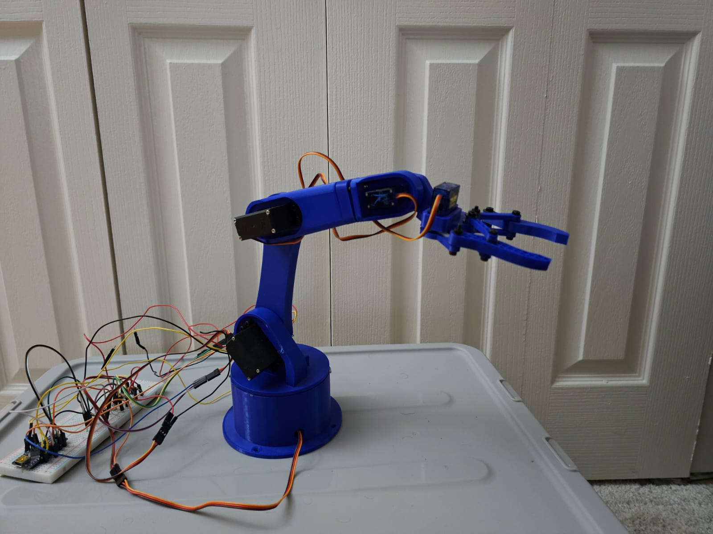
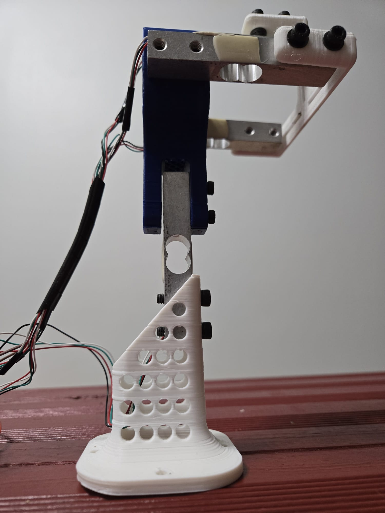

## Hi there 👋

So nice to see you here,

I am a Robotics engineer and like learning new things.  

Next things I wanna learn 🌱 is machine learning and neural network, and to use it in some controls application, possibly using for modeling of actuators.

💬 Talk me about -> Interesting Algorithms, Innovative Actuators, Arduino, ESP32, 3d-Printing and more... 

Here are some interesting projects I have worked on ---
***
#### :point_right: [Doto - Task prompter](https://github.com/Punit1024/Doto) 

Have you ever struggled with having multiple people approach you to help with various things and when that's done you have completely lost track of what you were doing and may be something else has consumed your mind and you start working on that instead of the original thing that you  had planned to finish today ? well that happens to me a lot. 
I thought wouldn't it be great to have my active task ever present in front of me to remind me/ pull me back into that. therefore I created this project.
This project uses an ESP32, a 16x4 LCD screen and 4 buttons. it will fetch your tasks from todoist.com and show you only one task at a time with option to close task, go-to next, go-to previous and a back button to go back to list of projects. 
So you can keep this at your work desk and it will keep displaying your active task.

***
#### :point_right: [6 DOF Robot Arm]()

Active project.. I am reusing the design from [ how to Mechatronics](https://howtomechatronics.com/projects/arduino-robot-arm-and-mecanum-wheels-platform-automatic-operation/) and will be trying out various inverse kinematic and motion planning algorithms 

***
#### :point_right: [Home Service Robot](https://github.com/Punit1024/HomeServiceRobot)

Simulate a home service robot that can map, localize, and navigate to transport objects, moving from one room to another autonomously.

***
#### :point_right: [GO_CHASE_IT](https://github.com/Punit1024/GO_CHASE_IT)
Ball chaser robot Simulation; ROS package that processes image published by Robot and publishes on topic \cmd_vel which commands robot to move contains to nodes

***
#####  :point_right: [3-Axis motor-propeller test bench]()

I have been recently fascinated by one and two propeller drone and have seen some great implementation out there for counter balancing the inertia and maneuvering the drone. I had few ideas of my own, and needed a safe way to validate those concepts. This project allows me to apply an controls algorithm to the motor and concept  actuators and see results if I can generate directional forces that would help in steer the drone. 

***
#### :point_right: [Map_My_World](https://github.com/Punit1024/Map_My_World)
Simulation inside Gazebo of robot that performs Simultaneous Localization and Mapping. 

***
#### :point_right: [Modeling Simulation and optimization of trebuchet](https://github.com/Punit1024/Advanced_Dynamics)
this project contrains modeling approach and simulation of a Trebuchet inside mathematica and adds various visualization to see imapact of different parameters. 

***
#### :point_right: [Various Vehicle Dynamics projects ](https://github.com/Punit1024/Electric-Vehicle-modeling-and-simulation)
- Modeling of 3-Phase PMSM with Vector Controls
- 4 DOF Vehicle Dynamics Model
- EV Range estimation 

  
<!--
**Punit1024/Punit1024** is a ✨ _special_ ✨ repository because its `README.md` (this file) appears on your GitHub profile.

-->
